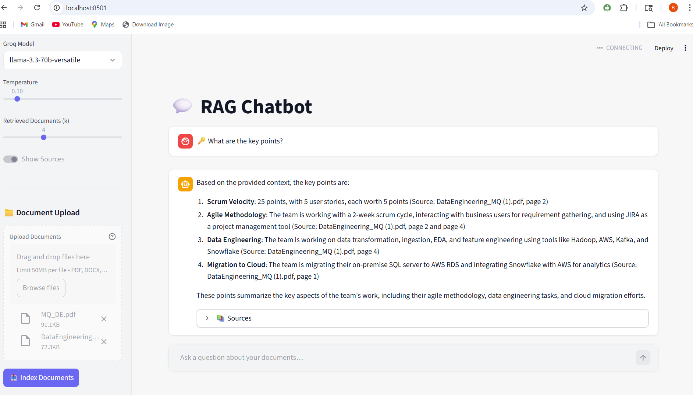

# 🧠 RAG Chatbot — Production-Ready Retrieval Augmented Generation

[](https://www.python.org/)
[](https://streamlit.io/)
[](https://www.langchain.com/)
[](https://groq.com/)
[](https://www.trychroma.com/)
[](https://www.docker.com/)
[](LICENSE)

A production-grade RAG (Retrieval Augmented Generation) chatbot that lets you upload documents and ask questions about them in natural language. Built with LangChain, ChromaDB, and Groq's ultra-fast LLM inference — it streams answers in real time, cites its sources, and remembers your conversation history.

---

## 📸 Screenshot



---

## ✨ Features

- **Multi-format document ingestion** — PDF, DOCX, TXT, Markdown, and CSV files supported out of the box
- **MMR retrieval** — Maximal Marginal Relevance search returns diverse, non-redundant context chunks
- **SHA-256 deduplication** — files are fingerprinted at ingest time so the same document is never indexed twice
- **Streaming responses** — tokens are pushed to the UI in real time via Groq's inference API
- **Conversation memory** — configurable sliding-window history keeps multi-turn context without ballooning token usage
- **Source citations** — every answer links back to the source file and page number
- **Production logging** — rotating file handlers with configurable log levels; logs persist across container restarts
- **Custom exception hierarchy** — typed exceptions (`DocumentIngestionError`, `LLMError`, `RetrievalError`, …) for clean error handling throughout the stack
- **Docker-ready** — multi-stage Dockerfile with a non-root user, health checks, and named volumes; deployable to Azure App Service in minutes

---

## 🏗️ Architecture

```
┌─────────────┐    ┌──────────────┐    ┌──────────────┐    ┌───────────────────┐
│  Documents  │───▶│  Ingestion   │───▶│   Chunking   │───▶│    Embedding      │
│ PDF/DOCX/   │    │  Validation  │    │  Recursive   │    │  all-MiniLM-L6-v2 │
│ TXT/MD/CSV  │    │  SHA-256     │    │  Text Split  │    │  (HuggingFace)    │
└─────────────┘    └──────────────┘    └──────────────┘    └────────┬──────────┘
                                                                     │
                                                                     ▼
┌─────────────┐    ┌──────────────┐    ┌──────────────┐    ┌───────────────────┐
│  Response   │◀───│   Groq LLM   │◀───│   Retrieval  │◀───│     ChromaDB      │
│  Streaming  │    │ LLaMA 3.3 70B│    │  MMR Search  │    │  Vector Store     │
│  + Sources  │    │  + Memory    │    │  Top-K Docs  │    │  (Persistent)     │
└─────────────┘    └──────────────┘    └──────────────┘    └───────────────────┘
```

---

## 🛠️ Tech Stack

| Component           | Technology                                      |
|---------------------|-------------------------------------------------|
| **LLM**             | Groq API — LLaMA 3.3 70B Versatile              |
| **Embeddings**      | `sentence-transformers/all-MiniLM-L6-v2`        |
| **Vector Store**    | ChromaDB (persistent, local)                    |
| **Orchestration**   | LangChain 0.3 (LCEL pipeline)                   |
| **UI**              | Streamlit with custom light theme               |
| **Document Loaders**| LangChain Community (PDF, DOCX, MD, CSV, TXT)   |
| **Text Splitting**  | `langchain-text-splitters` — Recursive chunking |
| **Configuration**   | Python dataclasses + `python-dotenv`            |
| **Logging**         | Python `logging` with `RotatingFileHandler`     |
| **Testing**         | pytest                                          |
| **Containerization**| Docker (multi-stage) + Docker Compose           |

---

## 🚀 Quick Start

### Prerequisites

- A free [Groq API key](https://console.groq.com/)


## 📁 Project Structure

```
rag-chatbot/
├── app/
│   ├── config.py               # Dataclass-based config, loaded from .env
│   ├── core/
│   │   └── rag_chain.py        # LCEL RAG pipeline, streaming, memory
│   ├── services/
│   │   ├── document_ingestor.py # Loaders, SHA-256 dedup, chunking
│   │   └── vector_store.py     # ChromaDB wrapper, MMR retrieval
│   ├── ui/
│   │   └── streamlit_app.py    # Full Streamlit UI with sidebar + chat
│   └── utils/
│       ├── exceptions.py       # Typed exception hierarchy
│       └── logger.py           # Rotating file + console logger
├── tests/
│   └── test_pipeline.py        # pytest suite (config, ingestor, chain, store)
├── data/
│   ├── chroma_db/              # Persisted vector store (git-ignored)
│   └── documents/              # Uploaded files (git-ignored)
├── logs/                       # Rotating log files (git-ignored)
├── .streamlit/
│   └── config.toml             # Streamlit theme + server settings
├── .env.example                # Environment variable template
├── Dockerfile                  # Multi-stage production image
├── docker-compose.yml          # Compose with named volumes
└── run.py                      # Entry point
```


## 📄 License

This project is licensed under the [MIT License](LICENSE).

---

<div align="center">

Built with [LangChain](https://www.langchain.com/) · [Groq](https://groq.com/) · [ChromaDB](https://www.trychroma.com/) · [Streamlit](https://streamlit.io/)

</div>
